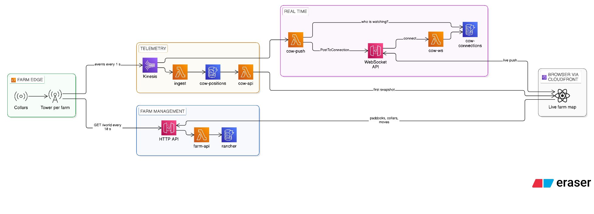
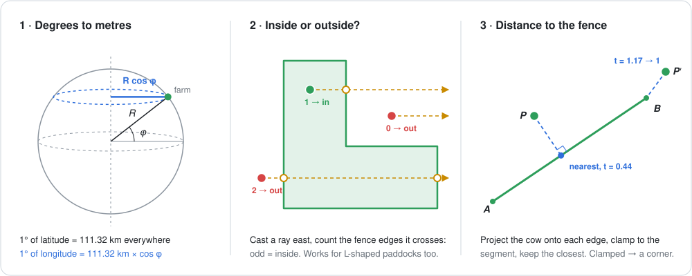
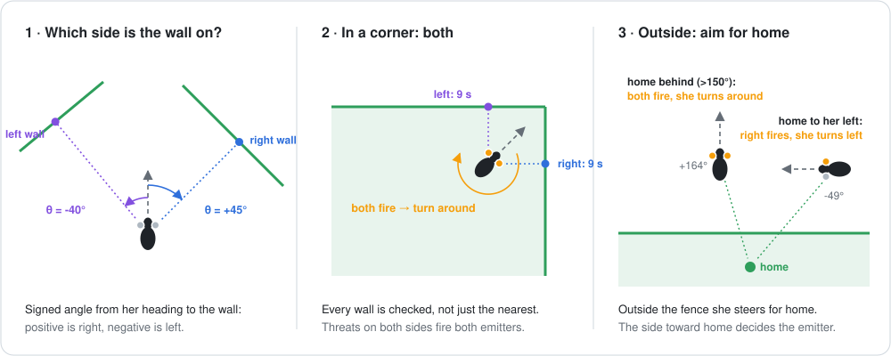
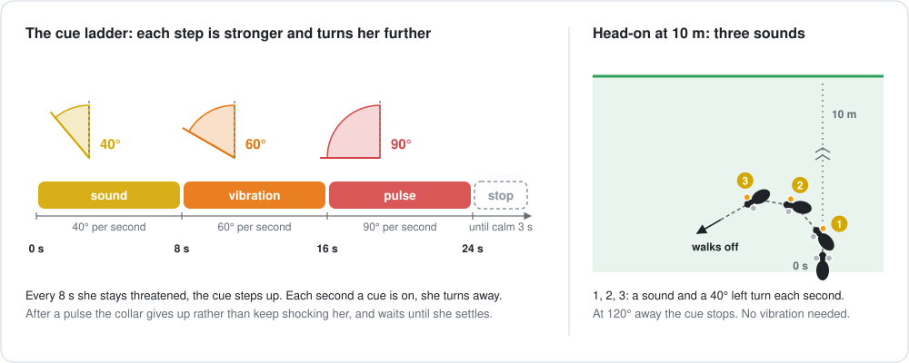
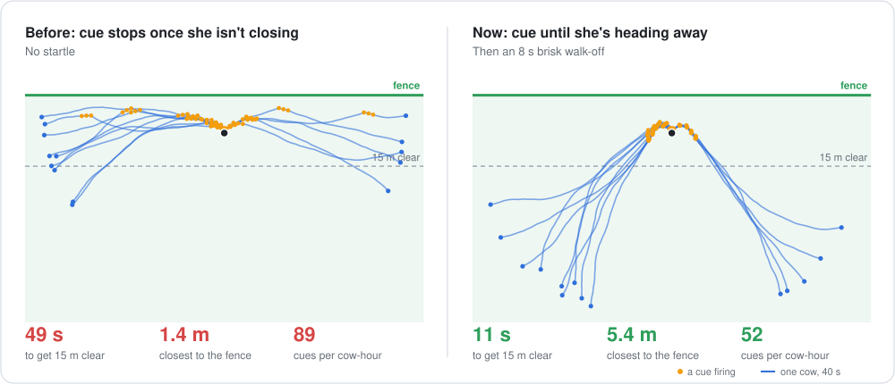
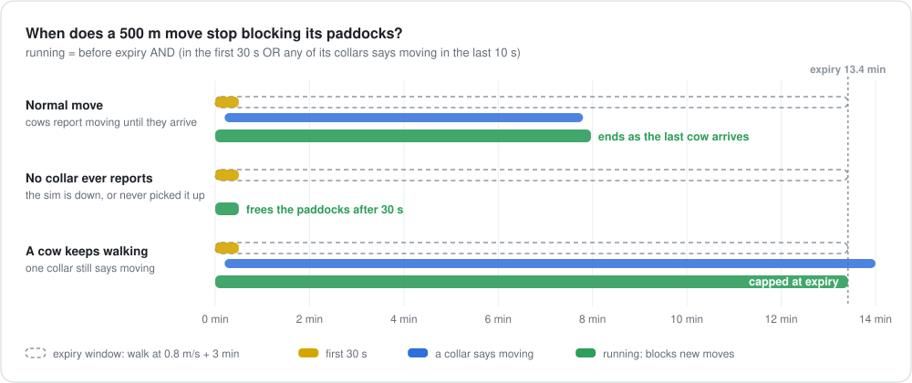

<p align="center">
  
</p>

<h1 align="center">Rancher</h1>

<p align="center">
  <b>Virtual fencing for cattle.</b><br>
  GPS collars keep cows inside paddocks with sound, vibration and pulse cues,<br>
  and walk the whole herd to fresh pasture along a lane drawn on a map.
</p>

<p align="center">
  
  
  
  
</p>

https://github.com/user-attachments/assets/9308bbc7-1300-410d-aa8e-bd03ac9a78b7

A portfolio build modelled on [Halter](https://halterhq.com): simulated collars at the edge, a streaming pipeline on AWS, and a live farm map updated over WebSockets.

- **The collar decides, not the cloud.** Each collar predicts when its cow will reach the fence and fires the left or right emitter about 10 seconds early, so she turns away before she gets there.
- **Move the herd by drawing a line.** Collars find the gate, guide every cow along the lane and into the new paddock, and can turn the herd back mid-walk.
- **Built for bad radio.** Fences are versioned and retried until every collar has them, and the map shows exactly how many are up to date.
- **About a second from collar to screen.** Tower → Kinesis → Lambda → WebSocket → map.
- **One command up, one command down.** The whole stack costs nothing while it's off.

<p align="center">
  <a href="#architecture">Architecture</a> ·
  <a href="#how-the-collar-thinks">Algorithms</a> ·
  <a href="#distributed-systems">Distributed systems</a> ·
  <a href="#run-it">Run it</a> ·
  <a href="#roadmap">Roadmap</a>
</p>

> The live demo runs on demand to keep costs at zero. Ask me for a link, or bring up your own copy with `./scripts/up.sh`.

## What it does, in 60 seconds

1. **Draw a paddock.** Click its corners on the satellite map. Its area is worked out for you.
2. **Collar the herd.** Add collars and assign them to the paddock. Within 10 seconds a cow appears for each collar and starts grazing.
3. **Watch the fence hold.** When a cow heads for the edge, her collar works out how soon she'll reach it and cues her from the side facing the fence: a sound first, then a vibration, then a mild pulse. She turns away and walks off.
4. **Move the herd.** Pick another paddock and draw the lane the cows should walk. Each collar guides its cow to the gate, along the lane and into the new paddock.
5. **Change your mind.** **Turn back** walks the herd home along the same lane. Drag a paddock's corners to reshape it, and the map shows how many collars have the new fence, for example `Fence v3 · 7/9 updated`.

Everything on the map is live: positions arrive about once a second, and the green badge shows they're being pushed over a WebSocket.

| On the map | Means |
|---|---|
| 🟢 green ring | grazing inside the fence |
| 🟡 amber ring | close to the fence |
| 🔴 red ring | outside the fence |
| 🔵 blue ring | walking a lane to a new paddock |
| Expanding ripple | a cue firing: yellow for sound, orange for vibration, red for a pulse |
| Orange dot behind an ear | which emitter is firing, left or right |

## Architecture

<picture>
  <source media="(prefers-color-scheme: dark)" srcset="docs/architecture-dark.png">
  
</picture>

<sub>Arrows point the way data flows. farm-api both reads and writes the farm table.</sub>

Three loops run through the system.

**1. Telemetry: collar to map in about a second**

Each farm has a tower that runs its collars. Every second the tower batches every collar's latest reading into one `PutRecords` call to Kinesis, using `farmer_id` as the partition key, so all of a farm's events land on one shard in order. Two Lambdas read the stream independently:

- **ingest** writes each reading to `cow-positions`, which keeps only the latest reading per collar.
- **cow-push** keeps each collar's newest event in the batch, looks up which browsers are watching that farm, and pushes one message per farm over the WebSocket.

**2. Real time: only farms someone is watching**

When the map opens, the browser connects to the WebSocket with its farm id. `cow-ws` stores the connection in `cow-connections`, and `$disconnect` deletes it. Connections that vanish without saying goodbye are removed the first time a push to them returns `410 Gone`. A farm with no viewers gets one small lookup per batch and no messages.

The browser loads a snapshot from `cow-api` first, then applies pushes. If pushes stop for 3 seconds it falls back to polling, and it drops any cow it hasn't heard from in 10 seconds.

**3. Control: farmer to collar within 10 seconds**

Paddocks, collars and herd moves live in the `rancher` table. Every 10 seconds each tower reads `/world` from the farm API, signed with its IAM role, and reconciles: new collars appear, a paddock change starts a herd move, and an edited boundary is queued for delivery to each collar over a lossy radio link.

The collars never wait for the cloud. Once a collar has its fence, it decides every cue by itself, so a dropped uplink never lets a cow walk out.

| Part | Built with | Why |
|---|---|---|
| Collars and towers | Go simulator on a `t4g.nano` | One process runs every farm; a new binary replaces the instance on deploy |
| Event stream | Kinesis on-demand, keyed by farm | In-order events per farm, and several independent readers |
| Latest positions | DynamoDB `farmer_id` + `collar_id` | One query returns a whole farm |
| Farm data | DynamoDB single table, API Gateway HTTP API | `FARMER#id` with `PROFILE`, `PADDOCK#`, `COLLAR#` and `SHIFT#` items, so a farm is one partition |
| Live updates | API Gateway WebSocket, connections table with a farmer index | Push instead of every browser polling every second |
| UI | React, MapLibre, Terra Draw, Amazon Location satellite tiles | Drawing paddocks and lanes directly on the map |
| Infrastructure | Terraform, `up.sh` / `down.sh` | The whole stack comes up and goes away with one command |

## How the collar thinks

Every collar runs the same loop once a second, entirely on the collar: where am I, how close is the fence, am I heading into it, and which way should I turn? It's all plain 2D geometry, with no GIS library and no call to the cloud.

### Geometry basics

<picture>
  <source media="(prefers-color-scheme: dark)" srcset="docs/geometry-dark.svg">
  
</picture>

**1. Degrees to metres.** GPS gives degrees, but fences are measured in metres. Around a single cow the ground is flat enough to use a local projection centred on her:

```math
x = (\lambda - \lambda_0) \cdot 111{,}320 \cdot \cos\varphi_0 \qquad y = (\varphi - \varphi_0) \cdot 111{,}320
```

A degree of latitude is about 111.32 km anywhere (40,075 km ÷ 360). Lines of longitude converge towards the poles, so a degree of longitude is that times cos φ: about 88 km at the demo farm, 37.7° S.

How wrong is a flat earth? Against the real ellipsoid at 37.7° S, the scale is off by 0.3% north–south and 0.1% east–west, and cos φ changes by only 0.006% across a 500 m paddock. On the 10 m warning distance that's 3 cm, far below GPS noise of 3–5 m. So one multiplication per axis replaces the haversine formula.

**2. Inside or outside: ray casting.** Cast a ray due east from the cow and count the fence edges it crosses. An odd count means she's inside. An edge from $a$ to $b$ crosses the ray when it straddles her latitude and the crossing is east of her:

```math
(a_y > y) \ne (b_y > y) \quad \text{and} \quad x < a_x + (y - a_y)\,\frac{b_x - a_x}{b_y - a_y}
```

- It's O(n) for an n-cornered paddock and works for concave shapes like an L.
- The half-open test `>` counts a corner that sits exactly on the ray once, not twice.
- It runs directly on degrees: stretching one axis never changes which side of an edge a point is on, so no projection is needed.

**3. Distance to the fence: projecting onto a segment.** In metres, with the cow at $P$ and an edge from $A$ to $B$, where $d = B - A$:

```math
t = \mathrm{clamp}\left(\frac{(P - A) \cdot d}{\lVert d \rVert^2},\ 0,\ 1\right) \qquad Q = A + t\,d \qquad \text{distance} = \lVert P - Q \rVert
```

$t$ is how far along the edge the nearest point lies. Clamping it to $[0, 1]$ keeps that point on the fence: past either end, the nearest point is the corner. The distance to the fence is the smallest over all edges.

The ray test tells the collar whether its cow is outside, and the nearest point on every edge becomes a *wall* that the next step checks.

Code: [`edge/fence.go`](edge/fence.go)

### Fence zones: time, not distance

<picture>
  <source media="(prefers-color-scheme: dark)" srcset="docs/zones-dark.svg">
  
</picture>

A collar could warn whenever its cow is within 10 m of the fence. It asks a better question instead: at her current speed and heading, how soon would she reach it?

For each wall $w$ from the step above, $d_w$ is the distance to it and $\theta_w$ is the angle between her heading and the direction to it, so she closes on it at $v\cos\theta_w$:

```math
\text{state} =
\begin{cases}
\text{breached} & \text{if the ray test says she is outside} \\
\text{warning} & \text{if some wall has } v\cos\theta_w > 0 \text{ and } \frac{d_w}{v\cos\theta_w} \le 10\ \text{s} \\
\text{inside} & \text{otherwise}
\end{cases}
```

Why time works better than distance:

- **Heading matters.** A cow walking at 1 m/s straight at the fence is caught 10 m out. At 60° only half her speed closes the gap, so she's caught at 5 m. Walking along the fence, never.
- **Grazing along a fence stays quiet.** A distance band would keep cueing a cow that's only grazing near an edge, even though she isn't going anywhere.
- **Speed matters.** A cow moving faster is flagged further out, when she needs more room to turn.

**States settle before they relax.** A worse state applies at once, and going from inside to warning or breached starts the first cue, a sound. A better state only applies after 3 calm seconds in a row, so a cow right at the 10-second mark doesn't flicker between states. During a herd move, a cow inside the move's fence shows as **moving**.

**Where 10 m still counts:**

- Once a cue starts while she's grazing, it keeps going while she's within 10 m of that wall and hasn't yet turned more than 120° away from it. Otherwise a cow that turned parallel to the fence would stop counting as a threat, and stop being cued, before she had actually moved away.
- A cow on a move has only arrived once she's inside the new paddock and at least 10 m from its edges.

Code: [`edge/collar.go`](edge/collar.go) (`assess` and `Observe`)

### Threat detection: which side?

<picture>
  <source media="(prefers-color-scheme: dark)" srcset="docs/threats-dark.svg">
  
</picture>

Each edge of the fence gives a wall: the nearest point on it. For each wall the collar measures the signed angle from her heading $\psi$ to that point:

```math
\theta_w = \mathrm{wrap}_{\pm 180^\circ}\left(\mathrm{atan2}(\Delta x, \Delta y) - \psi\right)
```

Compass bearings run clockwise from north, so $\theta_w > 0$ means the wall is on her right. It's the same test as the sign of the 2D cross product of her heading and the direction to the wall, done with a single `atan2`.

A wall is a threat when she'd reach it within 10 seconds (see [Fence zones](#fence-zones-time-not-distance)). The threats then choose the emitter. The one on the wall's side fires, and she turns away from it:

| Threats | Emitter | She turns |
|---|---|---|
| Only on her right, $\theta > +1^\circ$ | right | left |
| Only on her left, $\theta < -1^\circ$ | left | right |
| On both sides, as in a corner | both | around |
| Dead ahead, $\lvert\theta\rvert \le 1^\circ$ | one at random | away from it |

- **Every wall counts, not just the nearest.** Checking only the nearest wall would turn a cow in a corner away from one fence and straight into the other.
- **Head-on needs a tie-break.** Square to a fence the angle is about 0°, and its sign is just noise. A coin flip picks a side. After that first turn she's no longer head-on, so the geometry decides from then on.
- **Turning around is not quite 180°.** Both emitters turn her by 180° ± 17°, so a herd cued in the same corner doesn't walk back out in single file.

**Outside the fence, walls don't matter; home does.** Home is the paddock's centre, or during a move, the nearest point on the lane. The collar fires the emitter that turns her toward it:

```math
\text{emitter} =
\begin{cases}
\text{both, turn around} & \text{if } \lvert\theta_{\text{home}}\rvert > 150^\circ \\
\text{left, turn right} & \text{if } \theta_{\text{home}} > +1^\circ \\
\text{right, turn left} & \text{if } \theta_{\text{home}} < -1^\circ \\
\text{none} & \text{already heading home}
\end{cases}
```

How far each cue turns her, and what happens if she ignores it, comes next.

Code: [`edge/collar.go`](edge/collar.go) (`assess` and `sideToward`)

### The cue ladder

<picture>
  <source media="(prefers-color-scheme: dark)" srcset="docs/ladder-dark.svg">
  
</picture>

The first cue is always a sound. If she's still threatened, the collar steps up every 8 seconds:

```math
\text{cue}(t) =
\begin{cases}
\text{sound} & 0 \le t < 8\ \text{s} \\
\text{vibration} & 8 \le t < 16\ \text{s} \\
\text{pulse} & 16 \le t < 24\ \text{s} \\
\text{nothing} & t \ge 24\ \text{s}
\end{cases}
```

where $t$ counts the seconds she has stayed in warning or breached since the first cue. Each second a cue is on and a wall is still a threat, she turns away from it, further at every step:

```math
\psi \leftarrow \psi \mp \Delta \qquad \Delta = 40^\circ,\ 60^\circ,\ 90^\circ \ \text{for sound, vibration, pulse}
```

The right emitter subtracts, turning her left; the left emitter adds, turning her right.

- **A sound is usually enough.** Head-on from 10 m, three sounds turn her 120° away, as in the diagram. Coming in at a shallower angle, one or two do it.
- **The turn grows with the cue.** A cow that ignores the sound gets a vibration and a sharper 60° turn. The pulse turns her a full 90° at a time.
- **It gives up, on purpose.** After 8 seconds at pulse level the collar stops altogether rather than keep pulsing a cow that isn't responding. She may be panicked, stuck, or pushed by the herd, and more pulses won't help. It stays quiet until she has been calm for 3 seconds, then starts again from a sound. Animal welfare is the hard constraint on virtual fencing: a cow has to be able to learn the cue, and must never be pulsed without end. In a real system this is also when the farmer should get an alert, which is on the [roadmap](#roadmap).

What she does right after a cue comes next.

Code: [`edge/collar.go`](edge/collar.go) (`Observe`, `Step` and `cueTurnRad`)

### Startle and commit

<picture>
  <source media="(prefers-color-scheme: dark)" srcset="docs/startle-dark.svg">
  
</picture>

A cue only works if she actually leaves. Two rules make sure she does.

**Keep cueing until she's heading away.** One 40° turn from head-on leaves her walking at a shallow angle to the fence. Her closing speed drops, the 10-second test stops flagging her, and the cue stops. So she drifts along the fence and gets cued again and again, as on the left. Now, while she's grazing, a cue keeps going until she has turned more than 120° away from that wall, for as long as she's within 10 m of it.

**Then commit to walking away.** After every fence cue she's startled for 8 seconds: she walks 1.5× faster and holds her line.

```math
v = 1.5\,v_0 \qquad \lvert \Delta\psi_{\text{random}} \rvert \le 0.08\ \text{rad per second, instead of } 0.15
```

Her random heading change each second is uniform on $[-w, w]$, with variance $w^2/3$, so after $n$ seconds her heading has drifted by

```math
\sigma_n = w\sqrt{n/3}
```

Over the 8-second walk-off that's 7.5° instead of 14°, so she holds her escape heading about twice as straight, and covers 12 m instead of 8 m.

**Measured.** Each row runs 100 cows starting 8 m from a fence and heading within 30° of straight at it, plus 50 cows grazing for an hour in a 1 ha paddock:

| | Time to get 15 m clear | Closest to the fence | Cues per cow-hour, grazing |
|---|---|---|---|
| Neither rule | 49.2 s | 1.4 m | 89 |
| Startle only | 41.7 s | 1.1 m | 87 |
| Keep cueing only | 16.0 s | 4.8 m | 49 |
| **Both (now)** | **11.2 s** | **5.4 m** | **52** |

- **Keep cueing does most of the work:** 3× faster to get clear, 3.4 m more margin, and 45% fewer cues. Fewer cues is better for the cow.
- **Startle alone doesn't help.** Walking briskly along the fence isn't the same as leaving it. Paired with keep cueing, it takes another 30% off the time.
- **The trade-off:** startle adds about three cues per cow-hour (49 → 52) in exchange for clearing the fence 5 seconds sooner.
- **Only fence cues startle.** Guidance cues during a herd move don't, because a brisk walk-off there made cows overshoot the gate.

The "now" row is also a regression test: `TestCuedCowTurnsAndWalksAway` fails if the average goes over 20 s or any cow comes within 2 m of the fence.

Code: [`edge/cow.go`](edge/cow.go) (`Startle` and `Step`) and [`edge/collar.go`](edge/collar.go) (`assess`)

### Herd moves along a lane

<picture>
  <source media="(prefers-color-scheme: dark)" srcset="docs/lane-dark.svg">
  
</picture>

To move a herd, the farmer picks the new paddock and draws the path the cows should walk. Each collar turns that drawing into a temporary fence and something to aim at, and only nudges its cow when she strays.

**The lane** is every point within 4 m of the drawn path, so 8 m wide by default.

**The gate** is where the path first leaves the old paddock. The collar takes the first path segment that starts inside and ends outside, and intersects it with every paddock edge. For segments $a \to b$ and $c \to d$, with $r = b - a$, $s = d - c$ and $q = c - a$:

```math
t = \frac{q \times s}{r \times s} \qquad u = \frac{q \times r}{r \times s} \qquad \text{they cross if } 0 \le t \le 1 \text{ and } 0 \le u \le 1
```

Here $\times$ is the 2D cross product $x_1 y_2 - y_1 x_2$, and the smallest $t$ wins. The farmer never marks a gate: the collar works it out from the drawing. Like ray casting, this runs on raw degrees, because stretching an axis doesn't change $t$ or $u$.

**The move fence** is the union of all three:

```math
F_{\text{move}} = F_{\text{old}} \ \cup\ \{\, p : \mathrm{dist}(p, \text{path}) \le 4\ \text{m} \,\} \ \cup\ F_{\text{new}}
```

- Inside a paddock, its walls are its edges minus the stretch inside the lane, so the gate is an opening rather than a wall to be cued at.
- In the lane, the walls are the two points 4 m either side of the path, square to it at her position.
- Everything from threat detection works unchanged against these walls.

**Where to aim**, numbered as in the diagram:

1. In the old paddock, head for the gate.
2. Within 10 m of the gate, aim 5 m into the lane instead. Aiming at the gate itself made cows oversteer and swing into the lane's wall.
3. In the lane, find her nearest point on the path, at distance $s^*$ along it, and aim 5 m further on:

   ```math
   \text{target} = \text{path}(s^* + 5\ \text{m}) \qquad d = \text{her distance from the path}
   ```

   This is the look-ahead idea from pure-pursuit path tracking. Chasing a point ahead instead of the nearest one rounds corners smoothly and damps zig-zagging.
4. In the new paddock, head for its centre. She has arrived once she's inside and at least 10 m from its edges, and the collar switches to the new paddock's fence.

**Steering.** In the lane she steers $0.3\,\theta$ toward the target by herself each second, with little random wander (±0.08 rad), because cows naturally follow a lane. The collar only steps in when she strays, and switches off later than it switches on:

```math
\text{guiding} \leftarrow
\begin{cases}
\text{on} & \text{if } \lvert\theta\rvert > 60^\circ \text{ or } d > 1.5\ \text{m} \\
\text{off} & \text{if } \lvert\theta\rvert < 30^\circ \text{ and } d < 1\ \text{m} \\
\text{unchanged} & \text{otherwise}
\end{cases}
```

While guiding, it fires the emitter away from the target (both if the target is more than 150° behind her) and turns her by $0.6\,\lvert\theta\rvert$: a small stray gets a small nudge.

- Guidance waits while a fence cue is on, so the two never pull against each other.
- Guidance never startles her. A brisk walk-off after a nudge made cows overshoot the gate.

**Measured**, with 10 cows on the 500 m L-shaped lane in the diagram:
- They take 7.8 minutes on average.
- The furthest any cow strays from the centre line is 2.6 m, against a lane edge at 4 m.
- Guidance is on 3% of the time in the lane.
- Fence cues come about once every 2¼ minutes per cow.

`TestCowsWalkTheLaneWithFewCues` fails if fence cues in the lane go above one per cow every 2 minutes.

Code: [`edge/lane.go`](edge/lane.go) (`Gate`, `segmentHit` and `MoveFence`), [`edge/shift.go`](edge/shift.go) (`Guide`) and [`edge/collar.go`](edge/collar.go) (`followShift` and `guide`)

### Turn back

<picture>
  <source media="(prefers-color-scheme: dark)" srcset="docs/turnback-dark.svg">
  
</picture>

A move can be reversed at any moment. One API call does it in a single DynamoDB transaction:

1. **End the current move now.** The write is conditional on the move not having changed since it was read.
2. **Start a new move** with the same collars and lane, starting now, and the path reversed. If the path has length $\ell$:

   ```math
   \text{path}_{\text{back}}(s) = \text{path}(\ell - s)
   ```

3. **Point every collar back** at the old paddock.

If the move hasn't started yet, it's simply cancelled. If anything changed in the meantime, the transaction fails with a `409` and nothing is left half-done.

**There's no turn-back code on the collar.** Where she aims depends only on where she is, so a reversed path makes every cow do the right thing from wherever she happens to be:

| Where she is | What she does |
|---|---|
| In the lane | The point 5 m ahead on the reversed path is now behind her, more than 150° away, so both emitters fire and she turns around, then follows the lane home |
| Still in the old paddock | That's the new move's destination, so she heads for its centre and arrives |
| Already in the new paddock | She heads for the reversed path's gate, where it first leaves that paddock, then walks the lane home |

In the run above, the farmer turned back 47 seconds in, with three cows already in the lane. All five were home 25 seconds later, and none was ever breached. `TestTurnBackMidLaneWalksTheHerdHome` turns back herds of 5, 8 and 10 cows, once 3 or 5 are in the lane, and fails if any collar breaches or the herd isn't home in time.

Code: [`lambdas/farm-api/shifts.go`](lambdas/farm-api/shifts.go) (`turnBackShift`) and [`edge/tower.go`](edge/tower.go) (`Reconcile`)

## Distributed systems

Each collar decides on its own, but the cloud still has to tell it things, like a new fence or a herd move. It does that over rural radio that drops messages, and the farmer needs to know which cows have the change. Three problems come out of that.

### Fence versions over a lossy radio link

<picture>
  <source media="(prefers-color-scheme: dark)" srcset="docs/fence-versions-dark.svg">
  
</picture>

Every paddock carries a `fence_version`. It starts at 1, and each boundary edit adds 1 with DynamoDB's atomic `ADD`, so two edits at once can't lose an increment.

1. **The tower queues per collar.** Every 10 seconds it reads `/world`, compares each collar's fence and version with what it should have, and queues an update for each one that's behind. Re-reading the same world queues nothing. A newer edit replaces a queued older one, so a collar can't receive an old fence after a newer one.
2. **The radio retries.** Each second, each queued collar receives its update with probability $p = 0.8$. That's the simulator's model of a lossy link. Misses stay queued and try again the next second.
3. **The acknowledgement is free.** Every event a collar sends already carries the `fence_version` it's running, so the cloud learns who has the change from telemetry it receives anyway. There's no separate ack message to lose.
4. **The map compares versions.** A paddock shows `Fence v4 · 17/20 updated`, and each collar that's behind is tagged *syncing*. A cow partway through a move already has her destination's fence, so she's never counted as behind.

Until her update arrives, a collar keeps enforcing the fence it has. A cow is never without a fence.

**How long until every collar has it?** Each attempt fails with probability $1 - p$, independently, so a collar is still missing the update after $n$ seconds with probability $(1-p)^n$. For a herd of $N$:

```math
P(\text{all } N \text{ updated after } n \text{ s}) = \left(1 - (1-p)^n\right)^N \qquad \text{E}[\text{updated after } n \text{ s}] = N\left(1 - (1-p)^n\right)
```

With 20 collars that's 16 updated after one second on average, every collar within 2.7 seconds on average, and all 20 within 5 seconds 99% of the time. The 40 simulated towers in the chart land on the formula.

Solving for the time that reaches every collar with probability $q$:

```math
n \ge \frac{\ln\left(1 - q^{1/N}\right)}{\ln(1-p)} \approx \log_{1/(1-p)} \frac{N}{1-q}
```

The time grows with the log of the herd size: ten times more collars costs only $\log_5 10 \approx 1.4$ more seconds.

| Collars | 20 | 100 | 1,000 | 10,000 |
|---|---|---|---|---|
| Seconds to reach all, 99% of the time | 5 | 6 | 8 | 9 |

`TestFenceUpdateReachesEveryCollarDespiteLoss` edits a paddock under 20 collars and checks that some but not all have it after one second, that all 20 get it, and that each collar reporting the new version really has the new boundary.

Code: [`edge/tower.go`](edge/tower.go) (`Reconcile` and `Tick`), [`lambdas/farm-api/paddocks.go`](lambdas/farm-api/paddocks.go) (`updatePaddock`) and [`ui/src/components/PaddockDetail.tsx`](ui/src/components/PaddockDetail.tsx)

### When is a move "running"?

<picture>
  <source media="(prefers-color-scheme: dark)" srcset="docs/running-dark.svg">
  
</picture>

A running move blocks new moves on its two paddocks, so you can't send a herd into a paddock another herd is still walking out of. Knowing whether a move is still running is harder than it looks, because its state lives in two places: the plan in the farm table, and the truth in the collars' telemetry, which arrives seconds later.

```math
\text{running}(t) = t < t_{\text{expire}} \ \wedge\ \left( t < t_{\text{start}} + 30 \text{ s} \ \vee\ \exists\, c : \text{moving}_c(t) \right)
```

Here $\text{moving}_c(t)$ means collar $c$'s latest reading says `moving` and is less than 10 seconds old, and

```math
t_{\text{expire}} = t_{\text{start}} + \frac{\text{path length}}{0.8 \text{ m/s}} + 3 \text{ min}
```

Each part has a job:

- **Telemetry ends it early.** The expiry is deliberately generous: cows walk at 1 m/s, but it assumes 0.8. On a 500 m lane the cows arrive after 7.8 minutes, while the expiry is 13.4. A move stops running as soon as no collar reports `moving`, so the farmer doesn't wait almost six minutes for nothing.
- **The first 30 seconds cover the gap.** A new move reaches the tower on its next `/world` read, up to 10 seconds later, and the first `moving` readings come after that. Without this window a brand-new move would look finished, and a second move could start on the same paddocks straight away.
- **The expiry is a hard upper bound, like a lease.** A cow that never finds the gate, or a collar stuck on `moving`, can't block the paddocks forever.
- **Only fresh readings count.** A collar that goes silent stops counting after 10 seconds, so a dead collar can't keep a move alive.

**One rule, used in two places.** The API uses it to refuse a conflicting move with a `409`, and the map uses it to decide whether to show the move and its Turn back button. They used to disagree. The API only looked at the expiry, so after the cows had arrived the map showed no move while the API still refused a new one. Now both use the same rule.

`TestShiftRunningUntilItsCowsStopMoving` covers four cases: just started with no readings yet, cows still walking, cows arrived before the expiry, and expired even though a reading still says `moving`.

Code: [`lambdas/farm-api/shifts.go`](lambdas/farm-api/shifts.go) (`running`, `movingCollars` and `createShift`) and [`ui/src/useShifts.ts`](ui/src/useShifts.ts) (`useActiveShifts`)

### WebSocket fan-out

<picture>
  <source media="(prefers-color-scheme: dark)" srcset="docs/websocket-dark.svg">
  
</picture>

The map used to poll `cow-api` every second from every open browser. Now positions are pushed, and the work no longer grows with the number of people watching.

**Who's watching.** When a map opens, it connects with its farm id. `cow-ws` stores `{connection id, farmer id}` in `cow-connections`, which has an index on `farmer_id`, so the connections for a farm are one query away.

**Every batch.** `cow-push` reads the same Kinesis stream as ingest, independently of it. For each batch it:

1. keeps only each collar's newest event. The stream is partitioned by `farmer_id`, so a farm's events arrive in order and the last one wins.
2. looks up the farm's connection ids. A farm nobody is watching stops here.
3. sends one message per open map with `PostToConnection`.

**Why it scales.** With $V$ maps open on a farm of $N$ cows:

| Per second | Polling | Push |
|---|---|---|
| Lambda invocations | $V$, one per map | about 1 per batch, shared by every map |
| DynamoDB reads | $V \cdot N$ items, the whole farm for each map | 1 keys-only index lookup |
| Messages to browsers | $V$ | $V$ |

For a 100-cow farm with 10 maps open, that goes from 1,000 item reads a second to one lookup. The messages to browsers are the same; everything behind them isn't.

**Three layers of cleanup.** A closed tab sends `$disconnect`, which deletes its row. A tab that vanishes without saying goodbye (a crash, lost signal) is deleted the first time a push to it returns `410 Gone`. And every row expires after 2 hours, API Gateway's maximum connection time, so even a farm that never gets another event doesn't collect dead rows.

**Degrade, don't break.** The browser treats pushes as an optimisation, not a dependency:

- It loads a snapshot from `cow-api` first, so the map is never empty while the socket connects.
- If no push arrives for 3 seconds, it polls `cow-api` every second until pushes return. The badge turns grey.
- A closed socket reconnects after 2 seconds, which also covers API Gateway's 10-minute idle timeout and 2-hour limit.
- Positions from the snapshot and from pushes are merged by timestamp, so an older reading never overwrites a newer one.
- A cow silent for 10 seconds is dropped from the map.

That fallback caught a real problem on the first deploy. The push Lambda's Kinesis trigger took a minute or two to start, the socket was open but silent, and the old version stopped polling as soon as the socket opened, so the cows froze. The fix was to fall back on silence, not on the socket closing.

**A limit worth knowing.** One message carries a whole farm, and API Gateway caps a message at 128 KB. At about 320 bytes per cow, that's around 400 cows per farm before a message would need splitting.

Code: [`lambdas/ws`](lambdas/ws/main.go), [`lambdas/push`](lambdas/push/main.go), [`infra/ws.tf`](infra/ws.tf) and [`ui/src/useCows.ts`](ui/src/useCows.ts)

